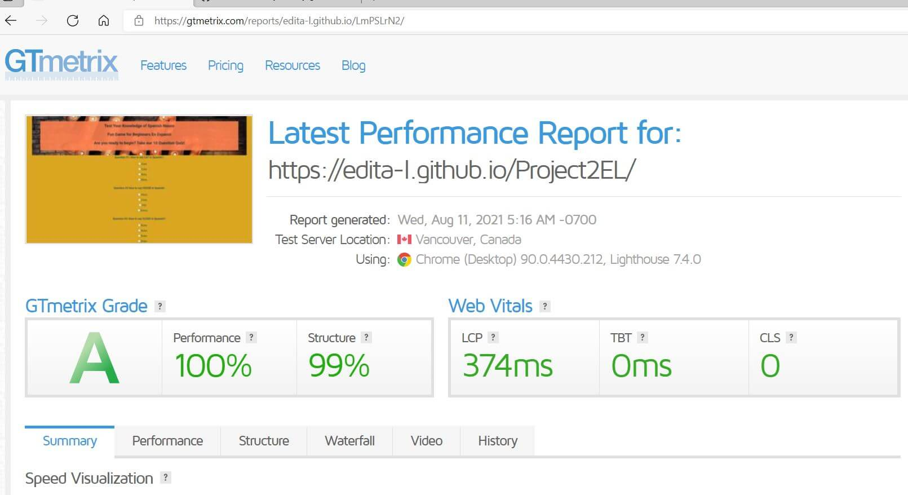

 

# Test Your Spanish - Online Quiz for checking knowledge of Basic Spanish Nouns
## https://edita-l.github.io/Project2EL/

---
## **Contents**
1. Introduction
2. UX
3. Wireframe
4. Visual Identity
5. Site Overview
6. User Stories
7. Testing & Code Validation
8. Deployment
9. Technologies
10. Acknowledgments and Thanks

## 1. Introduction

Test Your Spanish Site is designed for beginner levels srudents of Spanish language, and general public, who wish to test their knowledge of basis Spanish Nouns.
---

## 2. User Experience (UX)

I have attampted to create an uncluttered and responsive site with a very simple and clean index page where the main feature is an inviting background and an easy access to the ten question (each with four possible answer options)quiz.
The color scheme lends iteself to the Spanish feel.
Buttons allow user to easily check their answers and reload the page if they wish to re-try quiz.
The total score gives an indication of fraction of correct answers versus the total possible score.

- **The header:**
    * Gives a clear indication of concept of the quiz.
    has a spanish themed picture in the background, in tune with spanish theme ethos;

*   **HMain body:**
    * Has a central list of ten questions with various spanish nouns, each giving a clickable option of four radio button format answer choises
    * At the bottom of question list there is a button to Submit All the answers, upon which, the score results with brief message appear
    * The user then have a choice to press another, reload button, to re-try the same quiz.

*
---

## 3. Wireframe

The wireframe was designed using Balsamiq.
It has a basic intial structure, which remained throughout the project, with the styling slightly changed/enchanced for better viewing experience.
The styiling remains the same through all devices, with header only resizing slightly for mobiles.

Below is a link to all my wireframes:
## 

---

## 4. Visual Identity

 For this site, I wanted to use a simple word format in a classical font, to make it universal and appealing.

 I have used mainly combination of warm mediteranean colors and grey, to enchance Spanish theme, contunuity, seperate sections and to keep it uniform.
 
 The font colors and background colors are interchangebale as you scroll down the page to the buttons, to keep more appealing and easier on the eye to the user, as opposed to variety new colors being introduced.

 The Buttons change color on a click to keep it uniform and to give predictability for user.

 The Submit Button blends in with the background of the main page after click, to indicate that the quiz has finished and user should look out for the score.

 The Little message about the scores after submission gives a cheerful indication of how well user has done on that occasion.

 The footer has contact us link which re-directs to email on click, saving the user having to copy and paste.

 ## 5. Site Overview

 Images below show overview of the site:

 The header message and start of questions:

 

Main body with questions and answer options
 

End of quiz- option to Submit and then Restart if wished
 

Summary message on displaying test results
 

Footer segment with clickable email to get in touch

---

## 6. User Stories

*The site is designed for people looking to test their knowledge of basic Spanish Nouns.

**Users:**
* As a user, I'd like to easily see what the page is about on loading it initially.
* As a user, I'd like to see variety of questions listed in an uncluttered and easily readable way;
* As a user, being a beginner, I would like to have options of answers, which would help me to juggle my memory;
* As a user, I'd like to see the result of how well I have done, on submitting my answers to the quiz.
* As a user, I'd like to be able reload a page and try again, to see if i can do any better;
* As a user, I'd like to be able to contact the site owners if i think any naswers are incorrect or have other sufggestions/queries.

**Site Owner:**
* The site owner's main goal is that the user has a great experience and has fun;
* The site owner wants the navigation through the site to be clear and easy;
* The site owner wants all the necessary information for the user to complete the quiz to be readily accessible and easy to understand;
* The site owner wants the visuals of the quiz to be appealling and for the colours and design of the site to draw the user in;
* The site owner wants the user to have a clear summarising message once the game is finished;
* The site owner wants to make it straightforward for the user to restart the quiz when desired.
---

## 7. Testing & Code Validation

My website has been tested through the GTMetrix site,   
[GTmetrix](https://gtmetrix.com "GTmetrix Homepage")
Below is a screenshot of the results achieved, with performance and structure graded A by GTmetrix.

I have tested the site on a number of occasions throughout the building process, so that I could see it from different devices such as my mobile, tablet and PC and check for responsiveness.
During this testing I realised that I had to make some design changes to areas that I was not entirely happy with, and I made a number of changes to the page layouts, the colour schemes and fonts used. 
I have changed and added different buttons throughout the process, in the end settling in for just a couple main ones, that offer an option of submitting and reloading.

The biggest challenge was to add relevant functions to make site interactive, but that did not required too compliacted script.
I have settled for listing the questions and answers in html (original idea was to have an array in script and get them pulled out, but i just couldnt make it to work).
Then the correct answers are shown by using function for HTML ID's elements inner html.
I have used IF query for displaying answers to the questions that have aonly been answerd incorrectly (or not answer at all) as well as for displaying different result messages on submission.
I have also used FOR loop for calculating total score possible

W3C Markup Validation Service, the CSS Validation Service and the JSHint Javascript Validator were used for testing my codes..
There were some syntax mistakes, missed characters etc, that have been updated.

The screenshots of testing can be found below:

HTML:

CSS:

JavaScript:
This displayed a couple of warnings. I have looked at anumber of resources to see if i can find a way to get these warnings solved, but so far couldnt. AS the site is still working and no erros were shown, i have left script as it is for now.

*****
*****
*****

*Changes I would like to add:*
* I would like to find a way for displaying one question at a time, perhaps with relavnt background image for each;
* Adding a 'bank' of different questions with possible naswers, that can be drawn randomly on re-load ad are not the same each time.

**As a User I was able to:**
* See contact information clearly either straight away at the bottom of page or by scrolling down on smaller devices 
* Be taken to the product page by clicking on central button in Home page
* See images of products and click on 'Order' link from Cakes page
* Get basic information about business ethos from AboutUs page accesible from top nav bar
* Access company's social media accounts from footer on each page.
* Contact business by email or phone by clicking a relevant field in footer and not having to type text/numbers in.
* Forward order and any comments/enquiries by clicking on Order tab in Nav Links and filling Order form.

---
## 8. Deployment
This website has been deployed to GitHub Pages .

It was deployed ahead of time and modified on a number of occasions so that I would be able to check how things worked on different devices, and to ask others to test it themselves.

The process for deployment is documented below:

* Log into GitHub;
* Access the page with the repository for this project (https://github.com/Edita-L/Project2EL);
* Click on 'Settings' on the main menu over the file listing;
* Navigate down to 'GitHub Pages' and click on Dedicated Tab;
* Select 'Branch: Main' from the menu;
* This generates a live link for the website, which is now viewable publicly:

## Technologies
**Languages and Frameworks**
* HTML
* CSS

**Tools Used**
* Balsamiq: for creating wireframes
* Github and Gitpod: for creating and editing code
* Font Awesome: used for icons
* Google Fonts: Quicksand and Roboto fonts imported from google fonts
* Responsive Viewer: a google chrome extension used to test site at different screen sizes
* TinyPNG used to compress images
* W3C Validator used to validate HTML code
* CSS Validator used for checking CSS code
* Am I Responsive used for showing site views for different screen sizes
* Bootstrap for Jumbotron used on Index page

---

## Acknowledgments and Thanks
* Massive thank you to Felipe Alarcon for all the support, advise, ideas and feedback.
* David Walsh Blog for reset css
* Pure CSS for styling Header navigation links
* MarkdwonGuide
* Stack Overload
* Unsplash and BirzuDuona for images
* Google

---

